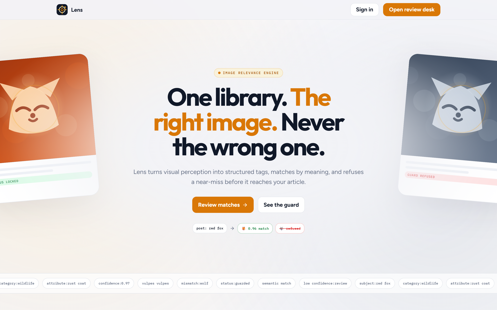
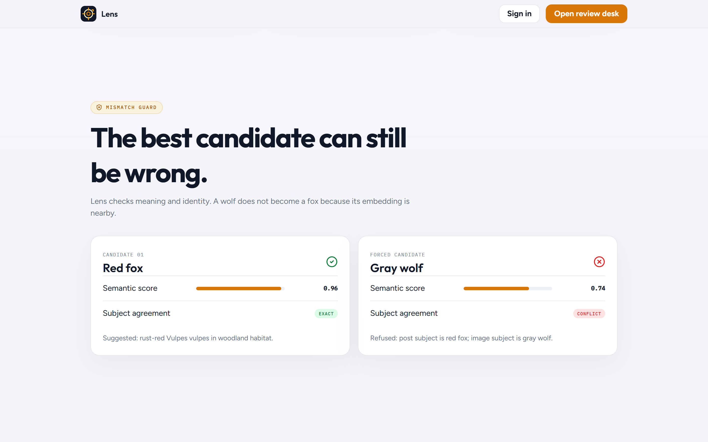
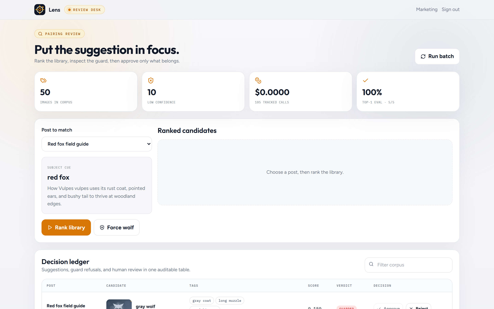
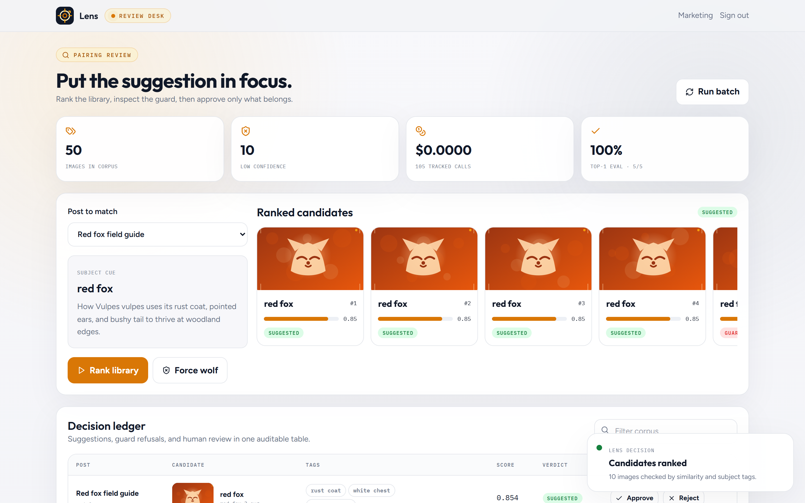
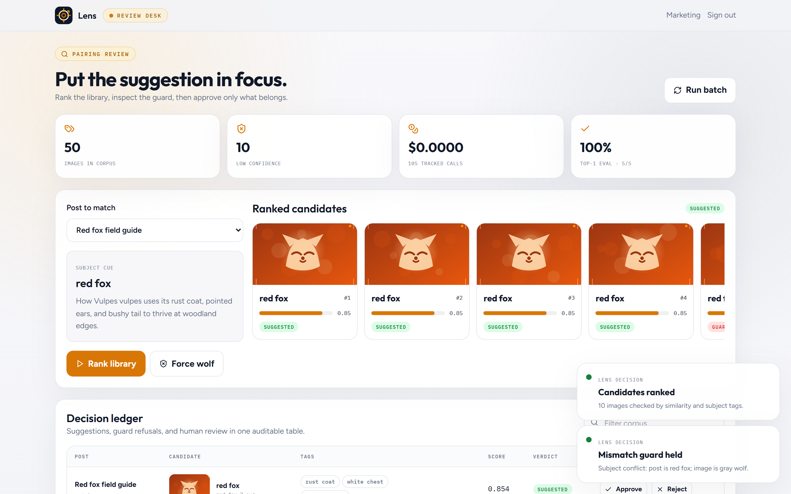
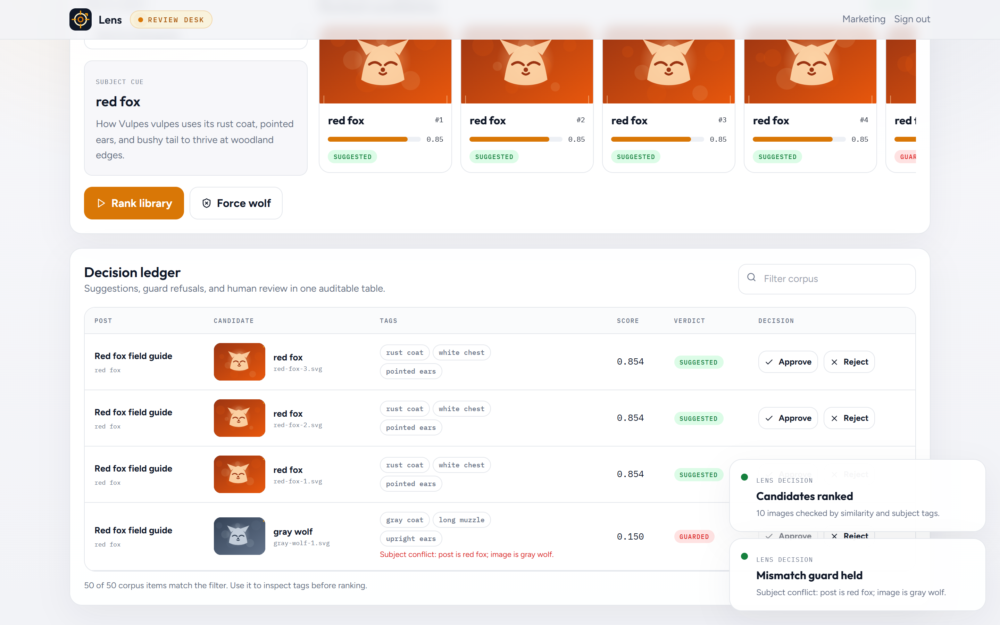

# Lens

### Fifty images. One semantic space. Wrong pairings refused.

A content team can have thousands of images whose filenames say almost
nothing. A nearest-neighbor score alone is not safe either: wolves, dogs, and
foxes are semantically close enough that the highest score can still be wrong.

Lens turns vision into validated tags, embeds image descriptions and post text
into one space, then applies a subject and confidence guard before it suggests
a pairing. The default seed providers make the whole pipeline reproducible
without cloud keys. An optional OpenAI-compatible path uses the same provider
interfaces.

**Run locally:** [Quick start](#quick-start) | [Prove it yourself](#prove-it-yourself) | [Architecture](#architecture)



## Why Lens

- **Structured perception:** every vision result is Zod-validated as subject, category, attributes, caption, and confidence.
- **No confident guessing:** low-confidence outputs move to review instead of becoming trusted tags.
- **Meaning over filenames:** deterministic shared-space embeddings connect paraphrases such as `vulpes vulpes` and `red fox`.
- **Versioned mismatch guard:** `guard_policy_v1` stores cosine, subject agreement, alias overlap, and floor flags on every pairing.
- **Honest no-match state:** a score below the floor returns `no_match` with a reason instead of forcing a weak image.
- **Durable batches:** SQLite jobs use idempotency keys, leases, heartbeats, retries, and partial-failure continuation.
- **Cost control loop:** every vision and embedding call is ledgered; `MAX_BATCH_USD` stops the worker when budget is spent.
- **Human review:** suggestions and refusals land in one decision ledger with approve and reject actions.
- **Bring your own library:** register uploads and CMS posts through `POST /api/library` or `pnpm library:import`.

## Who this is for

Lens is not only a wildlife Capstone. The fox/wolf case is the clearest proof
that nearest-neighbor ranking is unsafe. The same match-and-refuse engine is
useful for editorial CMS desks, ecommerce catalogs, and brand asset teams.

See [docs/MARKET.md](docs/MARKET.md) for buyer pain, bring-your-own setup, and
how to adapt subject aliases to another domain.

## The guard is the product

The fox/wolf case is not decorative demo copy. It is a direct test of the
decision core. A forced wolf pairing for a red-fox post returns `guarded` with:

```text
Subject conflict: post is red fox; image is gray wolf.
```



| Rule | Input | Result |
|---|---|---|
| Subject conflict | red fox post + gray wolf image | `guarded` |
| Weak similarity | score below `0.42` | `no_match` |
| Low confidence | confidence below `0.72` | `guarded` for review |
| All checks pass | matching subject + score + confidence | `suggested` |

Every persisted pairing stores `policyId` and `featuresJson` so refusals stay
auditable after the UI toast is gone.

## Review desk

Pick a post, rank all 50 images, inspect scores and tags, force the wolf case,
then approve only a valid suggestion. The desk also exposes corpus size,
tracked call count, remaining batch budget, top-1 precision, and matrix accuracy.









## Corpus and evaluation

The repository ships 50 deterministic SVG fixture images: five variants across
ten animal subjects. They are honest stand-ins generated for a zero-key
evaluation path, not claimed model photographs. Labeled posts cover exact
match, scientific-name paraphrase, wolf, dog, bird, big cat, and a true
no-match architecture post. A hard-negative matrix forces fox/wolf/dog
conflicts and low-confidence review cases.

| Eval case | Expected | Result |
|---|---|---|
| Red fox field guide | red fox | pass |
| Vulpes vulpes habitat | red fox | pass |
| Barn owl flight | barn owl | pass |
| Tiger stripes | tiger | pass |
| Gray wolf packs | gray wolf | pass |
| Family dog habits | domestic dog | pass |
| Urban rooftop gardens | no match | pass |

Run the measurable policy report:

```bash
pnpm eval
pnpm eval:sweep
```

`docs/eval/threshold-curve.md` records top-1 precision, no-match recall, false
refuse/accept rates, matrix accuracy, and a threshold sweep.

## Bring your own library

```bash
# place files under public/uploads first
pnpm library:import -- --image uploads/hero.jpg --name hero.jpg --slug landing-hero --title "Landing hero" --body "Spring launch hero brief." --subject "running shoe"
pnpm corpus:classify
pnpm corpus:embed
```

Or `POST /api/library` with demo auth. Extend `SUBJECT_ALIASES` in
`config/guard.config.ts` for your domain before trusting live rankings.

## API

| Method | Route | Purpose |
|---|---|---|
| POST | `/api/auth/login` | demo key session |
| POST | `/api/jobs/classify` | enqueue pending vision work |
| POST | `/api/jobs/embed` | enqueue image and post embeddings |
| GET | `/api/jobs` | job timeline (lease, heartbeat, errors) |
| POST | `/api/worker/tick?drain=1` | claim due jobs |
| GET/POST | `/api/library` | library snapshot / register image or post |
| GET | `/api/images` | image library and tags |
| GET | `/api/posts` | post library |
| GET | `/api/posts/:id/images` | ranked candidates + guard verdicts |
| GET/POST | `/api/pairings` | review rows / forced-pair demo |
| POST | `/api/pairings/:id/decision` | approve or reject |
| GET | `/api/costs` | cost ledger, budget remaining, cost per outcome |
| GET | `/api/eval` | labeled eval + hard-negative matrix |

## Prove it yourself

### Structured schema, guard, ranking, and eval

```bash
pnpm test
# decision-core, policy features, idempotency, and eval floors
```

### Re-run the labeled set

```bash
pnpm eval
pnpm eval:sweep
```

### Rebuild the zero-key pipeline

```bash
pnpm db:seed
pnpm corpus:classify
pnpm corpus:embed
```

Expected:

```text
generated 50 fixture images
queued: 50, processed: 50
queued: 57, processed: 57
```

### Force the mismatch in the UI

1. Sign in with `lens_demo_key_001`.
2. Select **Red fox field guide**.
3. Press **Rank library**.
4. Press **Force wolf**.
5. The notice says **Mismatch guard held** and the ledger stores `guarded`.

## Quick start

### Prerequisites

- Node.js 18.18 or newer
- pnpm 9 or newer
- Git

### Clone, install, and run

Clone the repository first, then install and start the app:

```bash
git clone https://github.com/yuan05-afk/flyrank-capstone-lens.git
cd flyrank-capstone-lens
pnpm install
pnpm db:push
pnpm db:seed
pnpm corpus:classify
pnpm corpus:embed
pnpm dev
```

Open [http://localhost:3000](http://localhost:3000), sign in with
`lens_demo_key_001`, then open the review desk.

Use another port:

```bash
PORT=3200 pnpm dev
```

PowerShell:

```powershell
$env:PORT = "3200"
pnpm dev
```

### Optional live provider

Seed providers are the default and cost `$0.00`. To use the isolated live
provider seam locally:

```env
VISION_PROVIDER="openai"
EMBEDDING_PROVIDER="openai"
OPENAI_API_KEY="your-personal-key"
```

Never commit the key. The live path uses the same validated contracts and cost
events, but the deterministic seed path is the graded demo.

## Tests and quality checks

```bash
pnpm typecheck
pnpm lint
pnpm test
pnpm eval
pnpm eval:sweep
pnpm build
```

## Architecture

```text
images -> SQLite jobs (idempotent + leased) -> VisionProvider (+ schema repair)
      -> validated tags -> image vectors (model + dims stored)
posts  ---------------------------------> post vectors
post + images -> same-space cosine rank -> guard_policy_v1 features
              -> suggested | guarded | no_match -> approve/reject ledger
              -> cost ledger + MAX_BATCH_USD stop
```

The layer rule is `repository -> service -> route handler`. Provider SDK
details are isolated behind `VisionProvider` and `EmbeddingProvider`.

```text
app/            Next.js pages and validated route handlers
components/     Lens marketing primitives and focus-ring brand
config/         guard policy, aliases, pricing, batch budget
fixtures/       50-image catalog, posts, labeled eval + matrix
lib/            auth, DB client, validation, cosine similarity
providers/      contracts, seed providers, optional live providers
repositories/   Prisma access only
services/       classification, embedding, matching, guard, eval, worker, library, cost
scripts/        corpus generation, pipeline, BYO import, eval, threshold sweep
tests/          decision-core tests
docs/           architecture, market relevance, eval reports
```

See [docs/ARCHITECTURE.md](docs/ARCHITECTURE.md),
[docs/MARKET.md](docs/MARKET.md), and [docs/diagram.md](docs/diagram.md).

## Limitations

- The checked-in corpus uses generated SVG stand-ins so the repo remains cheap,
  deterministic, and redistributable. It does not claim production image-model
  accuracy.
- SQLite job claiming with leases is appropriate for this single-instance
  Capstone. A distributed deployment needs transactional row locking in Postgres.
- Seed embeddings are deterministic feature hashing, not a substitute for a
  production embedding model. The optional live provider implements that seam.
- The live vision path is implemented but not required or exercised without a
  user-supplied key.

## Technology

- Next.js App Router + TypeScript
- Prisma + SQLite
- Zod
- Vitest
- Framer Motion + Lenis
- Tailwind CSS

## Definition of done

- [x] Validated structured vision tags; low confidence is flagged
- [x] Durable batch classification with idempotency, leases, retries, and cost tracking
- [x] Shared-space semantic ranking with scientific-name paraphrase
- [x] Versioned mismatch guard with feature audit trail; fox rejects wolf
- [x] Expanded labeled eval + hard-negative matrix + threshold sweep report
- [x] Budget-aware cost summary and cost-per-outcome reporting
- [x] Bring-your-own library path and market relevance docs
- [x] Images, tags, embeddings, posts, pairings, jobs, costs, and indexes
- [x] Validated API and approve/reject review surface
- [x] Schema, guard, ranking, paraphrase, eval, and no-match tests
- [x] README, architecture docs, market docs, diagram, and real screenshots

<sub>Built by Yuan for FlyRankAI Backend AI Engineering, Week 10.</sub>
