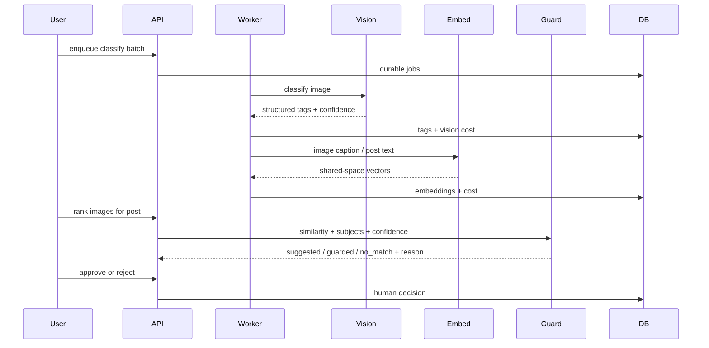

# Lens sequence

```mermaid
sequenceDiagram
  participant User
  participant API
  participant Worker
  participant Vision
  participant Embed
  participant Guard
  participant DB

  User->>API: enqueue classify batch
  API->>DB: durable jobs
  Worker->>Vision: classify image
  Vision-->>Worker: structured tags + confidence
  Worker->>DB: tags + vision cost
  Worker->>Embed: image caption / post text
  Embed-->>Worker: shared-space vectors
  Worker->>DB: embeddings + cost
  User->>API: rank images for post
  API->>Guard: similarity + subjects + confidence
  Guard-->>API: suggested / guarded / no_match + reason
  User->>API: approve or reject
  API->>DB: human decision
```
